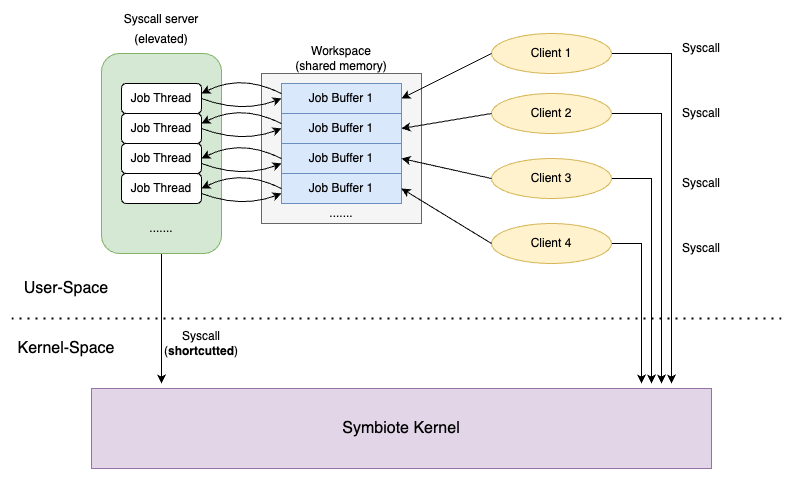

# Multithread Syscall Server Implementation

### Executables
- `client`: perform client behavior based on command line arguments. 
     - Usage: `./client <num_iteration> <if_independent> <cmd>`
     - example: `./client 1000 1 write` will launch the client to do 1000 write independently. 
     - currently only support *write* and *pid*.
- `server`: the syscall server, threads based on command line.
    - Usage: `./server <num_threads>`
    - example: `./server 1` will launch a single thread server.
    - currently only support one or two threads.
- `client_elevated/server_elevated`: same usage but using the shortcutted syscall instead of regular syscall.
- `serverkill`: will send a **server kill signal** to all running thread, which will properly close the server.
    - Usage: `./serverkill`

### Experiment Usage (to do)
- `ke_run_benchmark.sh`: experiment scripts that is compatible with this version of the server client example.
- Usage: `./ke_run_benchmark.sh <iterations> <loop_count>`
- example: `./ke_run_benchmark.sh 1000 50` will run the independent 1000 writes and server_elevated 1000 writes for 50 times, and write the results latency in `results.csv` file.
- **WARNING**: 
    - for some reason, elevated server does not support heavy load syscalls, the recommand iterations will be less than 10k. 
    - for each time, the `results.csv` will be overwritten, make sure to save the results somewhere else if you would like to continue using it.

### Terms
- `job_buffer`: shared memory where each server thread communicates with single client.
- `workspace`: an array of **job_buffer**s, allowing multiple thread to communicate through different clients.
- `job_buffer_thread`: a single thread that runs and handles requests from the client that is assigned to.

### APIs
- `server_init()`: server executable will call this function, initialize the shared memory and return the pointer to the **workspace**.
- `get_job_buffer()`: client executable will call this function to request a **job_buffer** from the server, return the pointer to the **job_buffer** if there is empty spot to connect.
- `connect_server()`: return the pointer to the **workspace** if the server is alive.
- `job_buffer_thread()`: the main function that handles the requests and perform the corresponding syscall, also the function that the server is multithreading. It takes the pointer to the job_buffer as parameter, and exit when it sees a **server kill signal** from user space or reach the timeout. 
    - current version have a hard coded timeout in it. 
- `server_write()`: Takes same argument as write and a **job_buffer** pointer, writes the argument to the **job_buffer** and return the server response when the response is written.
- `server_getppid()`: same logic as server write. 

### Related files
- `client.c`: source code of a simple program that does iterations of syscall loops.
- `server.c`: source code of the server that organize threads to handle syscall requests.
- `serverkill.c`: source code of sending **Server kill signal** to all running threads.
- `common.c`: implementation of the APIs for servers and clients to use.
- `common.h`: header files of the APIs and type definitons.
- `template.csv`: header of the csv files for experiment scripts to use.